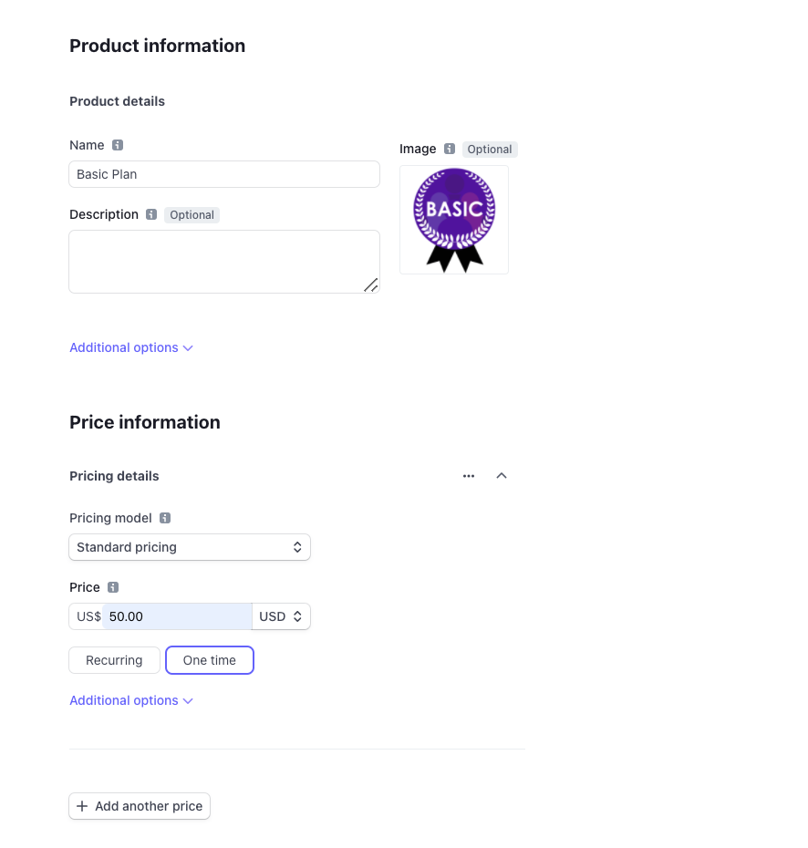

## Installation

```
pipenv shell
pip install stripe
pip install django
```
Inscription à Stripe : 
https://stripe.com/fr

Vous obtiendrez une API Key visible sur le dashboard

## Projet
```
django-admin startproject project
cd project
django-admin startapp stripapp
```

settings.py :
```py
# Application definition

INSTALLED_APPS = [
    'django.contrib.admin',
    'django.contrib.auth',
    'django.contrib.contenttypes',
    'django.contrib.sessions',
    'django.contrib.messages',
    'django.contrib.staticfiles',
    'stripapp'
]

...


STRIPE_PUBLIC_KEY = "###########"
STRIPE_SECRET_KEY = "#####" 
```

### Models
models.py : 
```py
from django.db import models


class Product(models.Model):
    name = models.CharField(max_length=100)
    stripe_product_id = models.CharField(max_length=100)

    def __str__(self):
        return self.name


class Price(models.Model):
    product = models.ForeignKey(Product, on_delete=models.CASCADE)
    stripe_price_id = models.CharField(max_length=100)
    price = models.IntegerField(default=0)
```

```
python manage.py makemigrations
python manage.py migrate
```

## views

Avant d'entamer cette étape, sur stripe.com , vous devez créer un produit et lui donner un prix. Celui-ci doit être répertorié ou instancié dans la partie admin de django.
N'oublier pas donc de noter stripe_product_id et stripe_price_id du produit pour cela!


views.py : 

```py
import stripe
from django.conf import settings
from django.shortcuts import redirect
from django.views import View
from django.views.generic import TemplateView

from stripapp.models import Price

stripe.api_key = settings.STRIPE_SECRET_KEY


class CreateCheckoutSessionView(View):

    def post(self, request, *args, **kwargs):
        price = Price.objects.get(id=self.kwargs["pk"])
        checkout_session = stripe.checkout.Session.create(
            payment_method_types=['card'],
            line_items=[
                {
                    'price': price.stripe_price_id,
                    'quantity': 1,
                },
            ],
            mode='payment',
            success_url=settings.BASE_URL + '/payments/success/',
            cancel_url=settings.BASE_URL + '/payments/cancel/',
        )
        return redirect(checkout_session.url)


class SuccessView(TemplateView):
    template_name = "success.html"


class CancelView(TemplateView):
    template_name = "cancel.html"


class HomePageView(TemplateView):
    template_name = "home.html"

    def get_context_data(self, **kwargs):
        product = Product.objects.get(name="Basic Plan")
        prices = Price.objects.filter(product=product)
        context = super(HomePageView, self).get_context_data(**kwargs)
        context.update({
            "product": product,
            "prices": prices
        })
        return context

```
## Urls 
project/urls.py :
```py
from django.contrib import admin
from django.urls import path, include

from stripapp.views import HomePageView

urlpatterns = [
    path('admin/', admin.site.urls),
    path('payments/', include('stripapp.urls')),
    path('', HomePageView.as_view(), name='home')
]

```

stripapp/urls.py : 
```py
from django.urls import path

from stripapp.views import CancelView, SuccessView, CreateCheckoutSessionView

urlpatterns = [
    path('cancel/', CancelView.as_view(), name='cancel'),
    path('success/', SuccessView.as_view(), name='success'),
    path('create-checkout-session/<pk>/', CreateCheckoutSessionView.as_view(), name='create-checkout-session')
]
```
## Templates

home.html :
```html

```

success.html :
```html
<html>

<head>
    <title>Thanks for your order!</title>
</head>

<body>
    <section>
        <p>
            We appreciate you gave us a chance and made a purchase on our website.
        </p>
        <a href="">Test again</a>
    </section>
</body>

</html>
```

cancel.html : 
```html
<html>

<head>
    <title>Checkout canceled</title>
</head>

<body>
    <section>
        <p>Forgot to add something to your cart? <a href="">Try again</a></p>
    </section>
</body>

</html>
```
